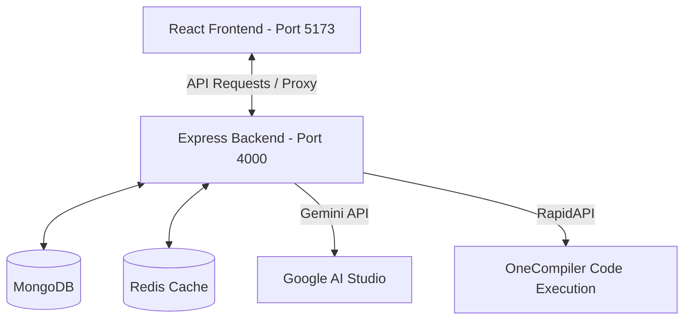

# 💻 CodeZen: Interactive Coding Platform & AI Tutor

CodeZen is a modern, full-stack online judge platform (like LeetCode) designed for developers to solve coding challenges, compile/run their code in real-time, and get step-by-step guidance from an AI Coding Assistant.

---

## 🌟 Key Features

*   **Online Code Judge**: Code execution in JavaScript, Python, C++, and Java (uses remote code compiler runner).
*   **🤖 AI Coding Assistant**: Side-by-side interactive chat powered by Gemini API to provide hints, explain complexity, and point out logical bugs without revealing direct solutions (following tutoring best practices).
*   **Mock Execution & Submissions**: Ability to run code on sample test cases or submit code to check against hidden test cases.
*   **Admin Dashboard**: Dedicated portal for administrators to create, update, and delete coding problems, test cases, and starter templates.
*   **User Profiles & Statistics**: Tracking solved challenges, submissions history, and performance stats.
*   **Secure Authentication**: JWT-based session security with token blacklisting using Redis.

---

## 🛠️ Tech Stack

| Component | Technology |
| :--- | :--- |
| **Frontend** | React, Vite, Tailwind CSS, DaisyUI, Axios, Redux Toolkit |
| **Backend** | Node.js, Express.js |
| **Database** | MongoDB (Mongoose ODM) |
| **Caching/Session** | Redis (Token Blacklisting) |
| **AI Integration** | Google Gemini API (`@google/generative-ai`) |

---

## 🚀 Quick Setup & Installation

### Prerequisites
*   [Node.js](https://nodejs.org/) installed (v18 or higher)
*   [MongoDB](https://www.mongodb.com/try/download/community) running locally (or MongoDB Atlas URI)
*   [Redis](https://redis.io/) running locally (port `6379`)

---

### Step 1: Clone & Configure Backend
1. Open the `/backend` directory.
2. Create a `.env` file (copying the structure below):
   ```env
   PORT=4000
   DB_CONNECT_STRING=mongodb://127.0.0.1:27017/CodeZen
   JWT_KEY=CodeZenSecretKey_12345
   REDIS_HOST_ID=127.0.0.1
   REDIS_PORT=6379
   GEMINI_API_KEY=your_gemini_api_key
   RAPIDAPI_KEY=your_onecompiler_api_key
   RAPIDAPI_HOST=onecompiler-apis.p.rapidapi.com
   ```
3. Install dependencies and start the backend:
   ```bash
   cd backend
   npm install
   
   # Optional: Seed the database with default problems and Admin user credentials
   node seed.js
   
   # Run backend server
   node src/index.js
   ```

---

### Step 2: Configure & Run Frontend
1. Open the `/frontend` directory.
2. Install dependencies:
   ```bash
   cd frontend
   npm install
   ```
3. Run the development client:
   ```bash
   npm run dev
   ```
4. Access the application in your browser at: `http://localhost:5173`

---

## 📂 Project Architecture



---

## 💡 Interview Questions / System Design Rationale

During placement interviews, be ready to explain these architectural decisions:
1. **Frictionless Onboarding**: We use direct user registration rather than email verification to ensure recruiters can sign up, log in, and test the platform in seconds.
2. **AI Tutor Guidelines**: The Gemini assistant is explicitly prompted to act as a *tutor*. It guides the user through debugging checklist patterns and hints, instead of outputting copy-paste code.
3. **Session Blacklisting**: When a user logs out, the token is stored in **Redis** with an expiration time matching the JWT's lifespan, preventing hijacked tokens from accessing protected routes.
4. **Vite Proxy Bypass**: Frontend runs on port `5173` and proxies `/api` calls to the backend on `4000` via Vite configurations, bypassing CORS issues cleanly during local development.
